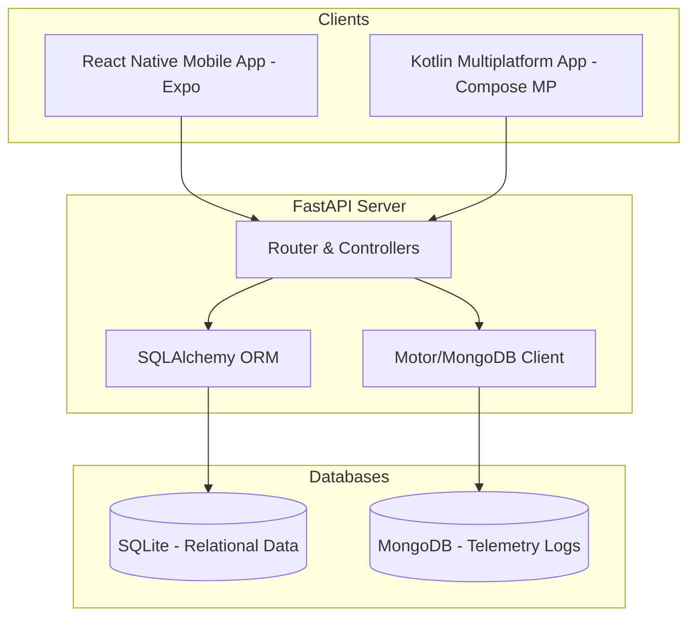

# RoadReady 🚗

Copyright (c) 2026 Hossein Hedayati. Licensed under the [GNU GPLv3](LICENSE).

RoadReady is a comprehensive digital platform designed to streamline driver education, lesson booking, and real-time performance evaluation. It empowers students, driving instructors, and schools with modern scheduling, payments, messaging, and advanced sensor-based ride diagnostics.

---

## 🌟 Key Features

### 1. Diagnostic Rides & Telemetry Processing
*   **Sensor Ingestion**: Tracks and uploads high-frequency GPS, accelerometer, and gyroscope data from the student's phone.
*   **Driving Fault Grading**: Auto-detects and logs steering mistakes, rolling stops, speeding, and improper lane positioning.
*   **Interactive Maps**: Replays routes with visual overlays of driving faults using Leaflet maps.

### 2. Marketplace & Scheduling
*   **Instructor Discovery**: Search by city, hourly rate, and availability.
*   **Smart Scheduling**: Self-service booking with automated conflict resolution.
*   **Payments & Connect Payouts**: Secure transactions using Stripe Connect checkout for lesson purchases and direct payouts to instructors.

### 3. Education & Engagement
*   **Learning Modules**: Native-like textbook reading for road signs and rules.
*   **Quizzes**: Comprehensive practice quizzes to prepare students for driving tests.
*   **Real-time Messaging**: Instant communication channel between students and instructors.

---

## 🛠️ Architecture & Tech Stack



### Backend
*   **FastAPI**: Asynchronous high-performance web framework.
*   **SQLite & SQLAlchemy**: Manages users, profiles, bookings, schedules, and billing.
*   **MongoDB (Motor)**: Handles high-volume, unstructured sensor telemetry data for diagnostic rides.

### Mobile Clients
1.  **React Native Expo (`/mobile-app`)**:
    *   *Status*: **Fully Feature-Complete MVP**.
    *   *Features*: Ingests device sensors (accelerometer, gyroscope, GPS), handles full checkout, messaging, quizzes, and dashboards.
2.  **Kotlin Multiplatform (`/mobile-app-kmp`)**:
    *   *Status*: **Incremental Modernization Rewrite (~10% complete)**.
    *   *Architecture*: Shared Compose Multiplatform UI, Ktor Client networking, Koin Dependency Injection, Decompose Navigation, and Multiplatform Settings storage.

---

## 🚀 Getting Started

### Prerequisites
- Python 3.10+
- Node.js & npm (for React Native/Expo)
- MongoDB running locally (or via Docker)
- Android Studio / Xcode (for mobile builds)

### 1. Running the Backend & Databases

You can run the backend services in one of two ways:

#### Option A: Running with Docker Compose (Recommended & Easiest)
This option automatically builds the backend container and runs a local MongoDB database instance:
1. Make sure you have Docker installed and running.
2. Build and start the containers in the root directory:
   ```bash
   docker compose up --build
   ```
3. Once the servers are running, seed the databases by running these commands in a separate terminal:
   ```bash
   docker compose exec web python seed.py
   docker compose exec web python seed_booking.py
   docker compose exec web python seed_quiz_comprehensive.py
   ```
   The API will be available at `http://localhost:8000` and API docs at `http://localhost:8000/docs`.

#### Option B: Running with a Local Virtual Environment
Use this option if you want to run Python and MongoDB manually outside of Docker:
1. Clone the repository and navigate to the project directory.
2. Create and activate a virtual environment:
   ```bash
   python -m venv venv
   source venv/bin/activate
   ```
3. Install dependencies:
   ```bash
   pip install -r requirements.txt
   ```
4. Run the seed scripts to populate database entries:
   ```bash
   python seed.py
   python seed_booking.py
   python seed_quiz_comprehensive.py
   ```
5. Start the FastAPI development server:
   ```bash
   ./run_server.sh
   ```
   The backend will be available at `http://localhost:8000`. API documentation can be accessed at `http://localhost:8000/docs`.


### 2. Running the React Native Mobile App
1. Navigate to the mobile app directory:
   ```bash
   cd mobile-app
   ```
2. Install dependencies:
   ```bash
   npm install
   ```
3. Start Expo:
   ```bash
   npx expo start
   ```
4. Scan the QR code with your Expo Go app (iOS/Android) or press `a` (Android) / `i` (iOS) to launch in simulators.

### 3. Running the Kotlin Multiplatform (KMP) App
1. Navigate to the KMP directory:
   ```bash
   cd mobile-app-kmp
   ```
2. Build and run the Android app:
   ```bash
   ./gradlew :androidApp:installDebug
   ```

---

## 📚 Technical Documentation & Reports

For a deep-dive into the architectural decisions, design specifications, and implementation details of the platform's sensor-telemetry evaluation engine, refer to the following documents in the [docs/](file:///home/hoss/Projects/road-ready/docs) folder:

*   **[Sensor System Analysis](file:///home/hoss/Projects/road-ready/docs/DIAGNOSTIC_SENSOR_SYSTEM_ANALYSIS.md)**: Deep analysis of mobile device accelerometer, gyroscope, and GPS sensors.
*   **[Ride Evaluator Implementation](file:///home/hoss/Projects/road-ready/docs/DIAGNOSTIC_RIDE_IMPLEMENTATION.md)**: Details on the backend evaluation logic, fault auto-detection algorithms, and database mappings.
*   **[Ride Evaluator Enhancements](file:///home/hoss/Projects/road-ready/docs/DIAGNOSTIC_RIDE_ENHANCEMENTS.md)**: Planned and completed improvements to the evaluation systems.
*   **[Road Ready Project Report](file:///home/hoss/Projects/road-ready/docs/ROAD_READY_REPORT.md)**: General summary and review of the platform.
*   **[Project Report (PDF)](file:///home/hoss/Projects/road-ready/docs/ROAD_READY_REPORT.pdf)**: A printable PDF edition of the project report.

---

## 📄 License & Intellectual Property

Licensed under the **GNU GPLv3** License. See the [LICENSE](file:///home/hoss/Projects/road-ready/LICENSE) file for details.